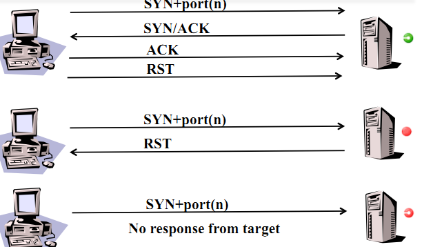

# 实验5 ：基于 Scapy 编写端口扫描器

## 实验目的

- 掌握网络扫描之端口状态探测的基本原理

## 实验环境

- python 3.8.2 + [scapy 2.4.5](https://scapy.net/) 
- 主机win10 20H2 +  虚拟机kali 2021.2

## 实验要求

- [x] 禁止探测互联网上的 IP ，严格遵守网络安全相关法律法规
- [x] 完成以下扫描技术的编程实现
  - TCP connect scan / TCP stealth scan
  - TCP Xmas scan / TCP fin scan / TCP null scan
  - UDP scan
- [x] 上述每种扫描技术的实现测试均需要测试端口状态为：`开放`、`关闭` 和 `过滤` 状态时的程序执行结果
- [x] 提供每一次扫描测试的抓包结果并分析与课本中的扫描方法原理是否相符？如果不同，试分析原因；
- [x] 在实验报告中详细说明实验网络环境拓扑、被测试 IP 的端口状态是如何模拟的
- （可选）复刻 `nmap` 的上述扫描技术实现的命令行参数开关

## 关于网络

拓扑图如下：


## 关于IPTABLES

- iptables(1.8.2-4) 用于模拟设置端口状态

- **iptables**是运行在[用户空间](https://zh.wikipedia.org/wiki/使用者空間)的应用软件，通过控制[Linux内核](https://zh.wikipedia.org/wiki/Linux內核)[netfilter](https://zh.wikipedia.org/wiki/Netfilter)模块，来管理网络数据包的处理和转发。

- 使用```sudo iptables -L```查看端口开放状态

  ```
  Chain INPUT (policy ACCEPT)
  target     prot opt source               destination
  
  Chain FORWARD (policy ACCEPT)
  target     prot opt source               destination
  
  Chain OUTPUT (policy ACCEPT)
  target     prot opt source               destination
  ```

  此时INPUT，FORWARD，OUTPUT三项均空，表示尚未配置IPtables。

  **Input** – This chain is used to control the behavior for incoming connections. For example, if a user attempts to SSH into your PC/server, iptables will attempt to match the IP address and port to a rule in the input chain.

  **Forward** – This chain is used for incoming connections that aren’t actually being delivered locally. Think of a router – data is always being sent to it but rarely actually destined for the router itself; the data is just forwarded to its target. Unless you’re doing some kind of routing, NATing, or something else on your system that requires forwarding, you won’t even use this chain.

  **Output** – This chain is used for outgoing connections. For example, if you try to ping howtogeek.com, iptables will check its output chain to see what the rules are regarding ping and howtogeek.com before making a decision to allow or deny the connection attempt.

## 端口模拟

查看相关协议端口：

```
netstat -ntlp #查看使用tcp协议端口情况
netstat -nulp #查看使用udp协议端口情况
```

如何模拟端口的三个状态（开放、关闭、过滤），以80端口为例：

| 端口状态 |                     命令                      |      |
| :------: | :-------------------------------------------: | :--: |
|   开放   |                  nc -l  -p80                  |      |
|   关闭   |                       /                       |      |
|   过滤   | iptables -A INPUT -p tcp --dport 80 -j REJECT |      |

- 清空过滤表：```iptables -t filter -F```

## 实验流程

### TCP包的标志位flags

详见https://blog.csdn.net/ChenVast/article/details/77978367

### FLAG（scapy）

```py
FIN = 0x01
SYN = 0x02
RST = 0x04
PSH = 0x08
ACK = 0x10

'F': 'FIN',
'S': 'SYN',
'R': 'RST',
'P': 'PSH',
'A': 'ACK',
```

### TCP connect scan

#### 课本提供原理



> 这种扫描方式可以使用 Connect()调用，使用最基本的 TCP 三次握手链接建立机制，建立一个链接到目标主机的特定端口上。首先发送一个 SYN 数据包到目标主机的特定端口上，接着我们可以通过接收包的情况对端口的状态进行判断：如果接收到的是一个 SYN/ACK 数据包，则说明端口是开放状态的；如果接收到的是一个 RST/ACK 数据包，通常意味着端口是关闭的并且链接将会被重置；而如果目标主机没有任何响应则意味着目标主机的端口处于过滤状态。
>
> 若接收到 SYN/ACK 数据包（即检测到端口是开启的），便发送一个 ACK 确认包到目标主机，这样便完成了三次握手连接机制。成功后再终止连接。

#### 脚本代码

详见[TCP connect scan](./tcp_connect_scan.py)

#### 端口开放

- 攻击者脚本输出如下：

  ```
  TCP connect scan:
  ===============================================
  Begin emission:
  Finished sending 1 packets.
  ...*
  Received 4 packets, got 1 answers, remaining 0 packets
  ===============================================
  Begin emission:
  Finished sending 1 packets.
  
  Received 133 packets, got 0 answers, remaining 1 packets
  State of port 80 of 192.168.56.114: Open
  ```

- 虚拟机内的抓包分析

  

  第二个包是[SYN/ACK]就已经能说明端口是开放的了。

  且和课本一致。

#### 端口关闭

- 攻击者脚本输出如下：

  ```
  TCP connect scan:
  ===============================================
  Begin emission:
  Finished sending 1 packets.
  .
  Received 1 packets, got 0 answers, remaining 1 packets
  ===============================================
  State of port 80 of 192.168.56.114: Closed
  ```

- 虚拟机抓包情况：

  

  与课本一致。

#### 端口过滤

- 攻击者脚本输出入下：

  ```
  TCP connect scan:
  ===============================================
  Begin emission:
  Finished sending 1 packets.
  ...*
  Received 4 packets, got 1 answers, remaining 0 packets
  ===============================================
  State of port 80 of 192.168.56.114: Filtered
  ```

- 虚拟机抓包情况如下：

  

  与课本仍一致。

### TCP stealth scan

#### 课本提供原理


#### 脚本代码

[TCP stealth scan](./tcp_stealth_scan.py)

#### 端口开放

- 攻击者脚本输出：

  ```
  TCP stealth scan:
  =================================================
  Begin emission:
  Finished sending 1 packets.
  ...*
  Received 4 packets, got 1 answers, remaining 0 packets
  =================================================
  Begin emission:
  Finished sending 1 packets.
  
  Received 269 packets, got 0 answers, remaining 1 packets
  State of port 80 of 192.168.56.114: Open
  ```

  

- 虚拟机抓包情况：

  

  和课本一致。

#### 端口关闭

- 攻击者脚本输出：

  ```
  TCP stealth scan:
  =================================================
  Begin emission:
  Finished sending 1 packets.
  ...*
  Received 4 packets, got 1 answers, remaining 0 packets
  =================================================
  State of port 80 of 192.168.56.114: Closed
  ```

  

- 虚拟机抓包情况：

  

  和书本所述一致。

#### 端口过滤

- 攻击者脚本输出：

  ```
  TCP stealth scan:
  =================================================
  Begin emission:
  Finished sending 1 packets.
  ...*
  Received 4 packets, got 1 answers, remaining 0 packets
  =================================================
  State of port 80 of 192.168.56.114: Filtered
  ```

  

- 虚拟机抓包情况：

  

  和书本所述一致。

### TCP Xmas scan

#### 课本提供原理


#### 脚本代码

[TCP Xmas scan](./tcp_xmas_scan.py)

#### 端口开放

- 攻击者脚本输出：

  ```
  TCP xmas scan:
  ================================================
  Begin emission:
  Finished sending 1 packets.
  .......
  Received 7 packets, got 0 answers, remaining 1 packets
  ================================================
  State of port 80 of 192.168.56.114: Filtered or Open
  ```

  

- 虚拟机抓包情况：

  

  与课本一致。

  

#### 端口关闭

- 攻击者脚本输出：

  ```
  TCP xmas scan:
  ================================================
  Begin emission:
  Finished sending 1 packets.
  ...*
  Received 4 packets, got 1 answers, remaining 0 packets
  ================================================
  State of port 80 of 192.168.56.114: Closed
  ```

  

- 虚拟机抓包情况：

  

  

#### 端口过滤

- 攻击者脚本输出：

  ```
  TCP xmas scan:
  ================================================
  Begin emission:
  Finished sending 1 packets.
  ...*
  Received 4 packets, got 1 answers, remaining 0 packets
  ================================================
  State of port 80 of 192.168.56.114: Filtered
  ```

  

- 虚拟机抓包情况：

  

  和书本一致

### TCP fin scan

#### 课本提供原理


#### 脚本代码

[TCP fin scan](./tcp_fin_scan.py)

#### 端口开放

- 攻击者脚本输出：

  ```
  TCP fin scan:
  =================================================
  Begin emission:
  Finished sending 1 packets.
  .
  Received 1 packets, got 0 answers, remaining 1 packets
  =================================================
  State of port 80 of 192.168.56.114: Filtered or Open
  ```

  

- 虚拟机抓包情况：

  

  和课本一致。

#### 端口关闭

- 攻击者脚本输出：

  ```
  TCP fin scan:
  =================================================
  Begin emission:
  Finished sending 1 packets.
  ...*
  Received 4 packets, got 1 answers, remaining 0 packets
  =================================================
  State of port 80 of 192.168.56.114: Closed
  ```

  

- 虚拟机抓包情况：

  

  和课本一致。

#### 端口过滤

- 攻击者脚本输出：

  ```
  TCP fin scan:
  =================================================
  Begin emission:
  Finished sending 1 packets.
  .
  Received 1 packets, got 0 answers, remaining 1 packets
  =================================================
  State of port 80 of 192.168.56.114: Filtered or Open
  ```

  

- 虚拟机抓包情况：

  

  和课本一致。

### TCP null scan

#### 课本提供原理


#### 脚本代码

[TCP null scan](./tcp_null_scan.py)

#### 端口开放

- 攻击者脚本输出：

  ```
  TCP null scan:
  ================================================
  Begin emission:
  Finished sending 1 packets.
  .
  Received 1 packets, got 0 answers, remaining 1 packets
  ================================================
  State of port 80 of 192.168.56.114: Filtered or Open
  ```

  

- 虚拟机抓包情况：

  

#### 端口关闭

- 攻击者脚本输出：

  ```
  TCP null scan:
  ================================================
  Begin emission:
  Finished sending 1 packets.
  ...*
  Received 4 packets, got 1 answers, remaining 0 packets
  ================================================
  State of port 80 of 192.168.56.114: Closed
  ```

  

- 虚拟机抓包情况：

  

  和课本一致。

#### 端口过滤

- 攻击者脚本输出：

  ```
  TCP null scan:
  ================================================
  Begin emission:
  Finished sending 1 packets.
  ...*
  Received 4 packets, got 1 answers, remaining 0 packets
  ================================================
  State of port 80 of 192.168.56.114: Filtered
  ```

  

- 虚拟机抓包情况：

  

  和课本一致。

### UDP scan

#### 课本提供原理


#### 脚本代码

- 返回一个UDP包，说明端口为开放状态(unusual)
- ICMP type 3,code 3 说明端口为关闭状态
- ICMP type 3,code 1, 2, 9, 10, or 13 端口为过滤状态
- 没有回应，过滤或者开放

详见[UDP scan](./udp_scan.py)

#### 端口开放(换了一台靶机192.168.48.128)

- 不同点在于，这次使用53端口，且```nc -l -p 53```无法直接打开该端口，需要利用dnsmasq服务开启来使该端口处于监听中；

  ```
                                                                                           
  ┌──(kali㉿kali)-[~]
  └─$ sudo systemctl start dnsmasq.service                                                                                             
  ┌──(kali㉿kali)-[~]
  └─$ netstat -nlup                       
  (Not all processes could be identified, non-owned process info
   will not be shown, you would have to be root to see it all.)
  Active Internet connections (only servers)
  Proto Recv-Q Send-Q Local Address           Foreign Address         State       PID/Program name    
  udp        0      0 0.0.0.0:53              0.0.0.0:*                           -                   
  udp6       0      0 :::53                   :::*          
  ```

   

- 攻击者脚本输出：

  ```
  UDP scan:
  ============================================
  Begin emission:
  Finished sending 1 packets.
  .....
  Received 1 packets, got 0 answers, remaining 1 packets
  State of port 53 of 192.168.48.128: Filtered or Open
  ```

  

- 虚拟机抓包情况：

  

  和课本一致。

#### 端口关闭

- 攻击者脚本输出：

  ```
  UDP scan:
  ============================================
  Begin emission:
  Finished sending 1 packets.
  ...*
  Received 4 packets, got 1 answers, remaining 0 packets
  ============================================
  State of port 53 of 192.168.56.114: Closed
  ```

- 虚拟机抓包情况：

  

#### 端口过滤

- 攻击者脚本输出：

  ```
  UDP scan:
  ============================================
  Begin emission:
  Finished sending 1 packets.
  .
  Received 1 packets, got 0 answers, remaining 1 packets
  State of port 53 of 192.168.48.128: Filtered or Open
  ```

  

- 虚拟机抓包情况：

  

  和课本一致。

## 参考资料

- [scapy官方文档](https://scapy.readthedocs.io/en/latest/installation.html)
- [iptables-debian-wiki](https://wiki.debian.org/iptables)
- [iptables中文维基](https://zh.wikipedia.org/wiki/Iptables)
- [The Beginner’s Guide to iptables](https://www.howtogeek.com/177621/the-beginners-guide-to-iptables-the-linux-firewall/)
- [EddieXU](https://github.com/CUCCS/2021-ns-public-EddieXu1125/tree/chap0x05/chap0x05)
- [tcp标志位](https://blog.csdn.net/ChenVast/article/details/77978367)
- [课本](https://c4pr1c3.github.io/cuc-ns/chap0x05/main.html)

