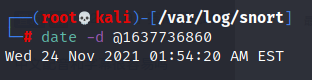
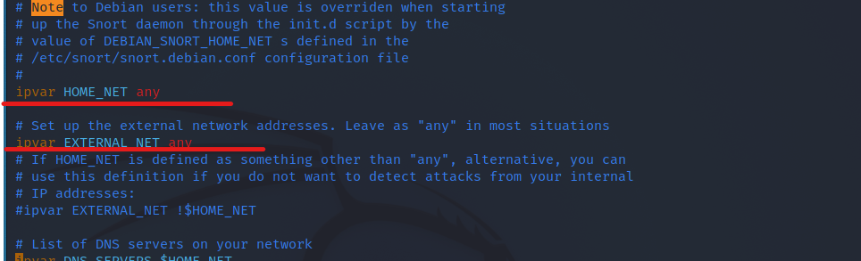
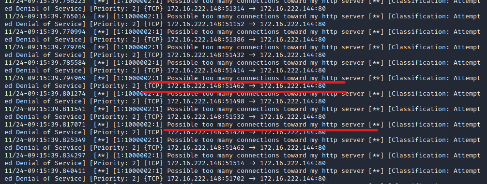
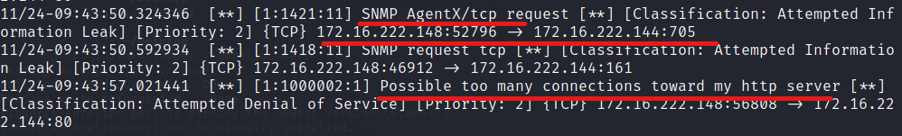

# 第九章  入侵检测实验

[toc] 

## 拓扑结构

内部网络intnet2中(保持网关开启)：

kali-victim:172.16.222.144

kali:172.16.222.148

## 实验一：配置snort为嗅探模式

```snort -q -v -b -i eth1 "port not 22"```

然后打开浏览器随意访问几个网页。

- sudo su以后进入/var/log/snort/这一文件夹，

​				查看嗅探到的日志：

```
����a�4��^��
'
E�]�r���8�����#l��M-SEARCH * HTTP/1.1
HOST: 239.255.255.250:1900
MAN: "ssdp:discover"
MX: 1
ST: urn:dial-multiscreen-org:service:dial:1
USER-AGENT: Google Chrome/96.0.4664.45 Windows

���a�;��^��
'
E�]�r���8�����#l��M-SEARCH * HTTP/1.1
HOST: 239.255.255.250:1900
MAN: "ssdp:discover"
MX: 1
ST: urn:dial-multiscreen-org:service:dial:1
USER-AGENT: Google Chrome/96.0.4664.45 Windows

���aL?��^��
'
E�]�r���8�����#l��M-SEARCH * HTTP/1.1
HOST: 239.255.255.250:1900
MAN: "ssdp:discover"
MX: 1
ST: urn:dial-multiscreen-org:service:dial:1
USER-AGENT: Google Chrome/96.0.4664.45 Windows

���a�C��^��
'
E�]�r���8�����#l��M-SEARCH * HTTP/1.1
HOST: 239.255.255.250:1900
MAN: "ssdp:discover"
MX: 1
ST: urn:dial-multiscreen-org:service:dial:1
USER-AGENT: Google Chrome/96.0.4664.45 Windows

```

- 把无法读懂的时间后缀转换：

​				

## 实验二：配置并启用snort内置规则

- 将/etc/snort/snort.conf 中的 HOME_NET 和 EXTERNAL_NET 定义为 ```any```

## 实验三：自定义snort规则

- 新建自定义 snort 规则文件
- 意思是当任意来源来自任意端口的tcp报文到达80端口时发送警报

```
cat << EOF > /etc/snort/rules/cnss.rules
alert tcp \$EXTERNAL_NET any -> \$HTTP_SERVERS 80 (msg:"Access Violation has been detected on /etc/passwd ";flags: A+; content:"/etc/passwd"; nocase;sid:1000001; rev:1;)
alert tcp \$EXTERNAL_NET any -> \$HTTP_SERVERS 80 (msg:"Possible too many connections toward my http server"; threshold:type threshold, track by_src, count 100, seconds 2; classtype:attempted-dos; sid:1000002; rev:1;)
EOF
```

- 添加配置代码到 /etc/snort/snort.conf

  ```include $RULE_PATH/cnss.rules```

- 被攻击者开启嗅探
  ```snort -q -A fast -b -i eth0 -c /etc/snort/snort.conf -l /var/log/snort/```
  
  攻击者进行压力测试(打开apache2服务)
  
  ```ab -c 100 -n 10000 http://172.16.222.144/hello```这是snort捕捉到的信息（日志名为alert），正如输入的规则所示，弹出来警告（Possible too many connections toward my http server)。

- 当攻击者：

  ```ab -c 100 -n 100 http://172.16.222.144//etc/passwd```

  就会警报（Access Violation has been detected on /etc/passwd ）：

  

## 实验四：和防火墙联动

- 在kali-victim中：

```bash
# 解压缩 Guardian-1.7.tar.gz
tar zxf guardian.tar.gz

# 安装 Guardian 的依赖 lib
apt install libperl4-corelibs-perl
```

```bash
# 先开启 snort
snort -q -A fast -b -i eth0 -c /etc/snort/snort.conf -l /var/log/snort/

# 再在另一个窗口中
cd /Desktop/guardian
```

```ini
# 编辑 guardian.conf 并保存，确认以下2个参数的配置符合主机的实际环境参数。
HostIpAddr      172.16.222.144
Interface       eth0
```


```bash
# 启动 guardian.pl
perl guardian.pl -c guardian.conf
```

- 在kali(attacker)中：

  

  ```bash
  # nmap 暴力扫描 victim
  nmap 172.16.222.144 -A -T4 -n -vv
  ```

- 

​				这是snort给予的警报。

​				此时查看iptables表：

```bash
Chain INPUT (policy ACCEPT)
target     prot opt source               destination
REJECT     tcp  --  172.16.222.148       0.0.0.0/0            reject-with tcp-reset
DROP       all  --  172.16.222.148       0.0.0.0/0

Chain FORWARD (policy ACCEPT)
target     prot opt source               destination

Chain OUTPUT (policy ACCEPT)
target     prot opt source               destination

# 1分钟后，guardian.pl 会删除刚才添加的2条 iptables 规则

Chain INPUT (policy ACCEPT)
target     prot opt source               destination

Chain FORWARD (policy ACCEPT)
target     prot opt source               destination

Chain OUTPUT (policy ACCEPT)
target     prot opt source               destination
```

